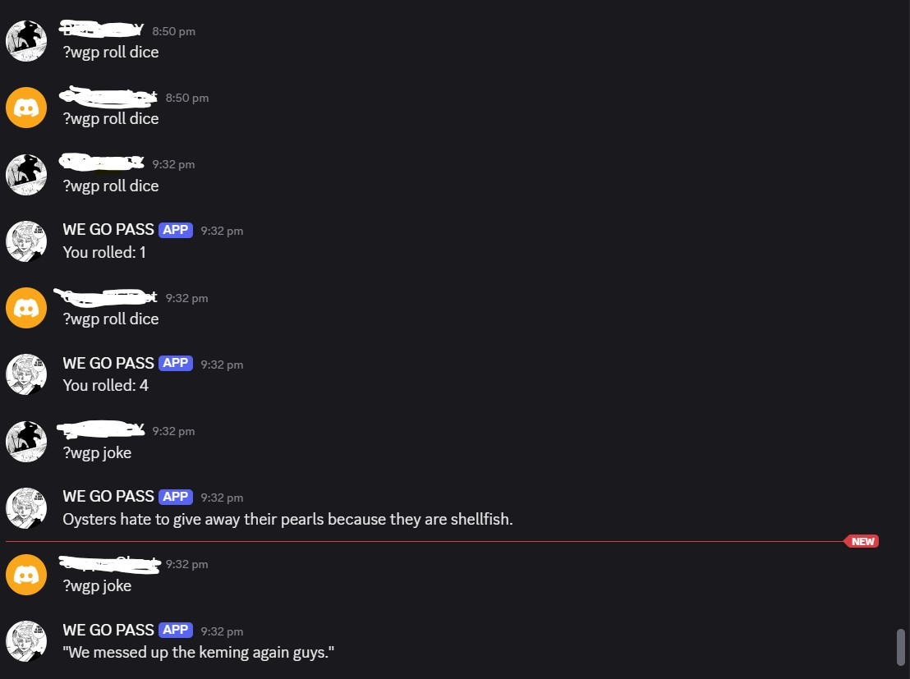

# WGP Discord Bot

A friendly Discord bot that can chat, tell jokes, play simple games, use AI, and respond to user commands.


---

## ✨ Features

- Responds to greetings and common questions.
- Provides random jokes from JokeAPI.
- AI-powered responses using the `?wgp ai <prompt>` command.
- Mini-games:
  - Dice roll 🎲
  - Coin flip 🪙
  - Number guessing 🔢
- Custom rule-based scenarios via `server_scenarios.py`.
- Fully extendable and easy to customize.

## Requirements

- discord.py
- python-dotenv
- requests
- groq
- google-genai


## Installation

### 1. Clone the repository:  

```bash
git clone https://github.com/JOSIAHTHEPROGRAMMER/discord-bot.git
cd discord-bot
```

### 2. Install dependencies:

```bash
pip install -r requirements.txt
```

### 3. Create a .env file in the project root and add your Discord bot token:

```ini
DISCORD_TOKEN=your_bot_token_here
GROQ_API_KEY=your_groq_api_key
GEMINI_API_KEY=your_gemini_api_key
OPENWEATHER_API_KEY=your_openweather_api_key
```

### 4. Usage

#### Run the bot locally with:

```bash
python main.py
```

#### The bot will respond to messages starting with the command prefix:

```php-template
?wgp <your message>
```
#### Example commands:



###  Notes
>Running locally means the bot will only be online while your machine is running.

>This bot is actively maintained and will receive updates in the future with new features and improvements.
